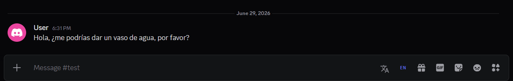
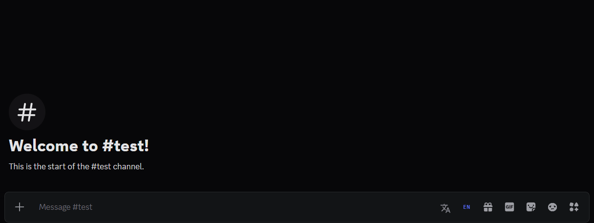

# SimpleTranslator

 

Translate messages or your own text before sending, directly in Discord.

## Features
- **Message Translation** – Right-click any message to translate it to your chosen language
- **Input Translation** – Translate your typed text before sending with the input bar button
- **Quick Toggle** – Left-click to enable, right-click to disable the input translator
- **30+ Languages** – Includes Arabic, Chinese, English, Japanese, Portuguese, Spanish, and more
- **Auto-detection** – Interface adapts automatically to Discord's language
- **Show Original** – Revert any translated message back to the original with one click

## Installation
1. Download [`SimpleTranslator.plugin.js`](https://github.com/8ug8ird/SimpleTranslator/releases/latest/download/SimpleTranslator.plugin.js)
2. Go to **Settings > Plugins > Open Plugins Folder**
3. Drop the file in and enable it

> [!WARNING]
> BetterDiscord goes against Discord's ToS. Use at your own risk.

MIT © [8ug8ird](https://github.com/8ug8ird) 🐦
